# CSOPESY Implementation Flowchart

## Current Todo Status
- ✅ Main menu console - COMPLETED
- ✅ Initialize command - COMPLETED  
- ✅ Screen commands fix - COMPLETED
- ❌ Process instructions - PENDING
- ❌ Scheduler commands - PENDING
- ❌ Report-util command - PENDING
- ❌ Process-smi command - PENDING
- ❌ CPU utilization - PENDING

## Implementation Flow

```mermaid
flowchart TD
    A[Start Implementation] --> B{Check Current State}
    B --> C[✅ Basic CLI Structure Done]
    
    C --> D[1. Implement Process Instructions]
    D --> D1[Create Instruction Classes]
    D1 --> D2[PRINT instruction]
    D2 --> D3[DECLARE instruction]
    D3 --> D4[ADD/SUBTRACT instructions]
    D4 --> D5[SLEEP instruction]
    D5 --> D6[FOR loop instruction]
    D6 --> D7[Integrate with PCB execution]
    
    D7 --> E[2. Fix Scheduler Commands]
    E --> E1[Rename scheduler-test to scheduler-start]
    E2[Implement scheduler-stop functionality]
    E3[Add process generation timer]
    E1 --> E2 --> E3
    
    E3 --> F[3. Implement Report-Util]
    F --> F1[Create report generation function]
    F1 --> F2[Format CPU utilization data]
    F2 --> F3[Write to csopesy-log.txt]
    
    F3 --> G[4. Add Process-SMI Command]
    G --> G1[Add command parsing in screen session]
    G1 --> G2[Display process info and logs]
    G2 --> G3[Handle finished process state]
    
    G3 --> H[5. Implement CPU Utilization]
    H --> H1[Track core usage statistics]
    H1 --> H2[Calculate utilization percentage]
    H2 --> H3[Update screen -ls output format]
    
    H3 --> I[6. Additional Requirements]
    I --> I1[Fix main menu welcome message]
    I1 --> I2[Add initialize command validation]
    I2 --> I3[Add process name validation]
    I3 --> I4[Fix config parameter validation]
    
    I4 --> J[Testing & Validation]
    J --> J1[Test all commands]
    J1 --> J2[Verify spec compliance]
    J2 --> K[✅ Implementation Complete]

    style D fill:#ffcccc
    style E fill:#ffcccc  
    style F fill:#ffcccc
    style G fill:#ffffcc
    style H fill:#ffffcc
    style I fill:#ccffcc
    style J fill:#ccccff
    style K fill:#ccffcc
```



## Detailed Implementation Steps

### 1. Process Instructions (HIGH PRIORITY)
```
Files to modify:
- include/instruction.hpp (NEW)
- src/instruction.cpp (NEW) 
- include/process_control_block.hpp
- src/process_control_block.cpp
- src/scheduler.cpp

Steps:
1. Create base Instruction class
2. Implement PRINT, DECLARE, ADD, SUBTRACT, SLEEP, FOR
3. Add instruction queue to PCB
4. Modify process execution to run instructions
5. Add variable storage to PCB
```

### 2. Scheduler Commands (HIGH PRIORITY)
```
Files to modify:
- src/commands.cpp (rename scheduler-test)
- src/dispatcher.cpp
- include/scheduler.hpp
- src/scheduler.cpp

Steps:
1. Rename "scheduler-test" to "scheduler-start"
2. Add process generation timer
3. Implement scheduler-stop functionality
4. Add batch process creation logic
```

### 3. Report-Util Command (HIGH PRIORITY) 
```
Files to modify:
- src/dispatcher.cpp
- include/scheduler.hpp
- src/scheduler.cpp

Steps:
1. Implement report generation function
2. Format CPU utilization and process data
3. Write to csopesy-log.txt file
4. Include running and finished processes
```

### 4. Process-SMI Command (MEDIUM PRIORITY)
```
Files to modify:
- src/screen.cpp

Steps:
1. Add process-smi command parsing in screen session
2. Display process information and logs
3. Handle "Finished!" state for completed processes
4. Update screen session command loop
```

### 5. CPU Utilization (MEDIUM PRIORITY)
```
Files to modify:
- include/scheduler.hpp
- src/scheduler.cpp

Steps:
1. Track active core count
2. Calculate CPU utilization percentage  
3. Update print_status() format to match spec
4. Add "CPU utilization: X%" header
5. Add "Cores used: X, Cores available: X"
```

## Priority Order
1. **Process Instructions** - Core functionality missing
2. **Scheduler Commands** - Basic scheduler operations
3. **Report-Util** - Required output functionality  
4. **Process-SMI** - Screen session enhancement
5. **CPU Utilization** - Status reporting improvement

## Files That Need Major Changes
- `src/process_control_block.cpp` - Add instruction execution
- `src/scheduler.cpp` - Add process generation and reporting
- `src/dispatcher.cpp` - Complete command implementations
- `src/screen.cpp` - Add process-smi command